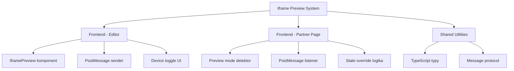
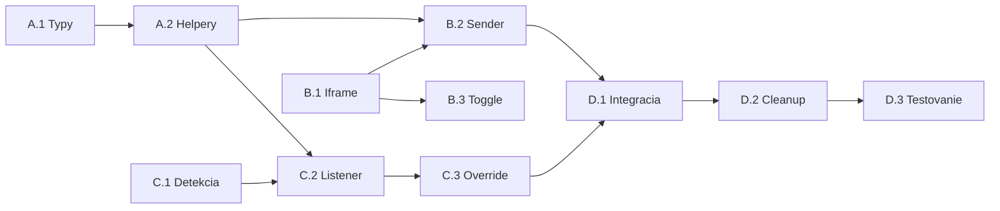

# Funkcny plan: Nahradenie TaxiPreview mockupu iframe-om

**Datum planovania**: 2026-01-18
**Odhadovana pracnost**: 14 task pointov

---

## 1. Prehlad funkcie

### 1.1 Ciel
Nahradit hardcoded `TaxiPreview.tsx` komponent iframe-om, ktory zobrazuje skutocnu stranku partnera (`/taxi/{citySlug}/{partnerSlug}`) s real-time preview draft dat z editora.

### 1.2 Rozsah
**Zahrna**:
- Iframe zobrazujuci realnu partner stranku
- PostMessage komunikacia medzi editorom a iframe
- Preview mode detekcia na partner stranke
- Real-time aktualizacia preview pri zmenach v editore
- Mobile/desktop toggle funkcionalita

**Nezahrna**:
- Zmeny v approve workflow
- Zmeny v Supabase scheme
- Nove API endpointy

### 1.3 Technicke obmedzenia
- Next.js 14 (App Router)
- Supabase pre databazu
- Existujuca `PartnerPageWrapper` logika musi zostat funkcna
- Same-origin policy pre iframe (rovnaka domena - OK)

---

## 2. WBS Rozklad uloh

### 2.1 Strukturny diagram



### 2.2 Zoznam uloh

---

#### Modul A: Zdielane utility (2 task pointy)

**Subor**: `lib/preview-protocol.ts`

- [ ] **Uloha A.1**: Vytvorit TypeScript typy pre PostMessage protokol (1 bod)
  - **Vstup**: FormData interface z PartnerEditor.tsx
  - **Vystup**: Typy pre spravovu komunikaciu
  - **Kroky**:
    1. Definovat `PreviewMessage` interface s typom a payload
    2. Definovat `PreviewFormData` type (subset FormData pre preview)
    3. Exportovat konstanty pre message types
    4. Pridat type guards pre bezpecne parsovanie

- [ ] **Uloha A.2**: Implementovat helper funkcie (1 bod)
  - **Vstup**: Typy z A.1
  - **Vystup**: `sendPreviewUpdate()`, `isPreviewMessage()` funkcie
  - **Kroky**:
    1. `sendPreviewUpdate(iframe, data)` - bezpecne posielanie
    2. `isPreviewMessage(event)` - validacia prichodiacich sprav
    3. Origin validacia pre bezpecnost

---

#### Modul B: Iframe Preview komponent (4 task pointy)

**Subor**: `app/partner/edit/[slug]/IframePreview.tsx`

- [ ] **Uloha B.1**: Zakladna struktura IframePreview (2 body)
  - **Vstup**: Props z PartnerEditor (formData, slugy)
  - **Vystup**: Funkcny iframe s header controls
  - **Kroky**:
    1. Skopirovat header/controls z TaxiPreview.tsx
    2. Nahradit obsah iframe elementom
    3. Iframe src = `/taxi/${citySlug}/${partnerSlug}?preview=editor`
    4. Pridat ref pre pristup k iframe contentWindow
    5. Stylovat iframe container (mobile/desktop sirky)

- [ ] **Uloha B.2**: Implementovat PostMessage sender (1 bod)
  - **Vstup**: formData zmeny, iframe ref
  - **Vystup**: Real-time posielanie dat do iframe
  - **Kroky**:
    1. useEffect na sledovanie formData zmien
    2. Debounce (100-200ms) pre optimalizaciu
    3. Volat `sendPreviewUpdate()` pri kazdej zmene
    4. Cakat na iframe load pred prvym odoslanim

- [ ] **Uloha B.3**: Mobile/Desktop toggle (1 bod)
  - **Vstup**: viewMode state
  - **Vystup**: Responzivny iframe container
  - **Kroky**:
    1. Zachovat existujuci toggle UI z TaxiPreview
    2. Aplikovat CSS triedy na iframe wrapper
    3. Mobile: max-width 375px, height 667px
    4. Desktop: max-width 100%, auto height

---

#### Modul C: Partner stranka - Preview mode (5 task pointov)

**Subor**: `app/taxi/[...slug]/page.tsx` (uprava)

- [ ] **Uloha C.1**: Detekcia preview modu (1 bod)
  - **Vstup**: URL searchParams
  - **Vystup**: Boolean `isPreviewMode`
  - **Kroky**:
    1. Citat `?preview=editor` z URL
    2. Predat `isPreviewMode` do PartnerPageWrapper
    3. V preview mode preskocit niektore SEO/analytics

**Subor**: `components/inline-editor/PartnerPageWrapper.tsx` (uprava alebo novy)

- [ ] **Uloha C.2**: Vytvorit/upravit PartnerPageWrapper pre preview (2 body)
  - **Vstup**: isPreviewMode prop, initialData
  - **Vystup**: Wrapper s PostMessage listenerom
  - **Kroky**:
    1. Pridat `isPreviewMode` prop
    2. Ak isPreviewMode, registrovat event listener na 'message'
    3. Validovat origin a message type
    4. Aktualizovat Context/state s preview datami
    5. Cleanup listener pri unmount

- [ ] **Uloha C.3**: State override logika (2 body)
  - **Vstup**: PostMessage data, existujuci state
  - **Vystup**: Merged state pre renderovanie
  - **Kroky**:
    1. Vytvorit `previewOverrides` state v Context
    2. Pri prichode spravy mergovat s initialData
    3. Komponenty (EditableHeroTitle, atd.) citat z override ak existuje
    4. Hero image, gallery, services - vsetko musi reagovat
    5. Template variant (skin) prepinanie

---

#### Modul D: Integracia a upratovacie prace (3 task pointy)

**Subor**: `app/partner/edit/[slug]/PartnerEditor.tsx`

- [ ] **Uloha D.1**: Nahradit TaxiPreview za IframePreview (1 bod)
  - **Vstup**: Existujuci import TaxiPreview
  - **Vystup**: Import a pouzitie IframePreview
  - **Kroky**:
    1. Zmenit import
    2. Upravit props ak treba
    3. Otestovat ze editor funguje

- [ ] **Uloha D.2**: Odstranit TaxiPreview.tsx (0.5 boda)
  - **Vstup**: Stary subor
  - **Vystup**: Zmazany subor
  - **Kroky**:
    1. Overit ze nikde inde sa nepouziva
    2. Zmazat subor
    3. Odstranit pripadne nepouzivane importy

- [ ] **Uloha D.3**: Testovanie a edge cases (1.5 boda)
  - **Vstup**: Kompletna implementacia
  - **Vystup**: Funkcny system bez bugov
  - **Kroky**:
    1. Test: Zmena textu sa prejavi v iframe
    2. Test: Zmena hero obrazku sa prejavi
    3. Test: Zmena template variantu meni skin
    4. Test: Mobile/desktop toggle funguje
    5. Test: Reload iframe nestraca data
    6. Test: Gallery zmeny

---

## 3. Zavislosti

### 3.1 Graf zavislosti



### 3.2 Popis zavislosti

| Uloha | Zavisi na | Dovod |
|-------|-----------|-------|
| A.2 | A.1 | Helpery potrebuju typy |
| B.2 | A.2 | Sender pouziva helper funkciu |
| C.2 | A.2 | Listener pouziva validaciu |
| C.2 | C.1 | Listener sa registruje len v preview mode |
| C.3 | C.2 | Override reaguje na prichadzajuce spravy |
| D.1 | B.2, C.3 | Integracia potrebuje oba konce hotove |

### 3.3 Paralelne ulohy

Tieto ulohy mozu bezat sucasne:
- B.1 (Iframe struktura) || C.1 (Detekcia preview)
- B.3 (Toggle UI) || C.3 (Override logika)

---

## 4. Implementacne odporucania

### 4.1 Technicky vyber

| Potreba | Riesenie | Odovodnenie |
|---------|----------|-------------|
| Komunikacia iframe | PostMessage API | Standardny browser API, bezpecny |
| Debouncing | lodash.debounce alebo custom | Redukcia spravy pri rychlom pisani |
| State management | React Context | Uz pouzivany v PartnerPageWrapper |
| Validacia origin | window.location.origin | Ochrana pred cudzimi spravami |

### 4.2 Potencialne rizika

| Riziko | Dopad | Zmiernenie |
|--------|-------|------------|
| Iframe nenacitava data | Vysoky | Pridat loading state a error handling |
| PostMessage sa strati | Stredny | Implementovat "ready" handshake |
| Velke obrazky spomaluju | Stredny | Posielat len URL, nie data |
| CSP blokuje iframe | Vysoky | Overit CSP nastavenia (same-origin OK) |
| HMR sposobuje reload | Nizky | Dev-only, ignorovat |

### 4.3 Strategia testovania

- **Unit testy**: `isPreviewMessage()`, `sendPreviewUpdate()` (typy a validacia)
- **Integracne testy**: Editor -> Iframe komunikacia
- **E2E testy**: Kompletny flow editacie s preview
- **Manual testing**: Rozne browsery, mobile zariadenia

---

## 5. Akceptacne kriteria

Funkcia je hotova ak:

- [ ] Iframe zobrazuje realnu partner stranku
- [ ] Zmeny v editore sa okamzite premietaju v iframe
- [ ] Mobile/desktop toggle meni sirku iframe
- [ ] Tlacidlo "Otvorit" otvara stranku v novom tabe
- [ ] Template variant (skin) sa meni v realnom case
- [ ] Hero obrazok pozicia/zoom sa meni v realnom case
- [ ] Gallery zmeny sa prejavuju
- [ ] Ziadne console errory pri normalnom pouziti
- [ ] Stary TaxiPreview.tsx je zmazany

---

## 6. Buduci rozvoj (Phase 2)

Moznosti pre dalsie zlepsenia:
- Skeleton loading pre iframe
- Preview pre mobile s device frame
- Undo/redo v editore
- Side-by-side porovnanie draft vs live
- Komentare/anotacie na preview

---

## 7. Prilohy

### 7.1 Message Protocol Priklad

```typescript
// lib/preview-protocol.ts

export interface PreviewMessage {
  type: 'PREVIEW_UPDATE';
  payload: PreviewFormData;
}

export interface PreviewFormData {
  company_name: string;
  description: string;
  phone: string;
  hero_image_url: string;
  hero_image_zoom: number;
  hero_image_pos_x: number;
  hero_image_pos_y: number;
  services: string[];
  gallery: string[];
  template_variant: string;
  // ... dalsie polia
}

export function sendPreviewUpdate(
  iframe: HTMLIFrameElement,
  data: PreviewFormData
): void {
  if (iframe.contentWindow) {
    iframe.contentWindow.postMessage(
      { type: 'PREVIEW_UPDATE', payload: data },
      window.location.origin
    );
  }
}

export function isPreviewMessage(event: MessageEvent): event is MessageEvent<PreviewMessage> {
  return (
    event.origin === window.location.origin &&
    event.data?.type === 'PREVIEW_UPDATE'
  );
}
```

### 7.2 Iframe Component Skeleton

```tsx
// app/partner/edit/[slug]/IframePreview.tsx

'use client';

import { useState, useRef, useEffect } from 'react';
import { Monitor, Smartphone, ExternalLink } from 'lucide-react';
import { sendPreviewUpdate, PreviewFormData } from '@/lib/preview-protocol';

interface IframePreviewProps {
  formData: PreviewFormData;
  partnerSlug: string;
  citySlug: string;
}

export function IframePreview({ formData, partnerSlug, citySlug }: IframePreviewProps) {
  const [viewMode, setViewMode] = useState<'desktop' | 'mobile'>('mobile');
  const iframeRef = useRef<HTMLIFrameElement>(null);
  const [iframeLoaded, setIframeLoaded] = useState(false);

  const previewUrl = `/taxi/${citySlug}/${partnerSlug}?preview=editor`;

  // Send updates when formData changes
  useEffect(() => {
    if (iframeLoaded && iframeRef.current) {
      sendPreviewUpdate(iframeRef.current, formData);
    }
  }, [formData, iframeLoaded]);

  return (
    <div className="bg-white rounded-xl shadow-sm overflow-hidden flex flex-col h-full">
      {/* Header - rovnaky ako TaxiPreview */}
      <div className="bg-gray-50 px-4 py-3 border-b border-gray-200 flex items-center justify-between">
        {/* ... controls ... */}
      </div>

      {/* Iframe container */}
      <div className="flex-1 overflow-auto bg-gray-100 p-4">
        <div className={`mx-auto transition-all duration-300 ${
          viewMode === 'mobile' ? 'max-w-[375px]' : 'max-w-full'
        }`}>
          <iframe
            ref={iframeRef}
            src={previewUrl}
            className="w-full h-full min-h-[667px] bg-white rounded-lg shadow-lg"
            onLoad={() => setIframeLoaded(true)}
          />
        </div>
      </div>
    </div>
  );
}
```
